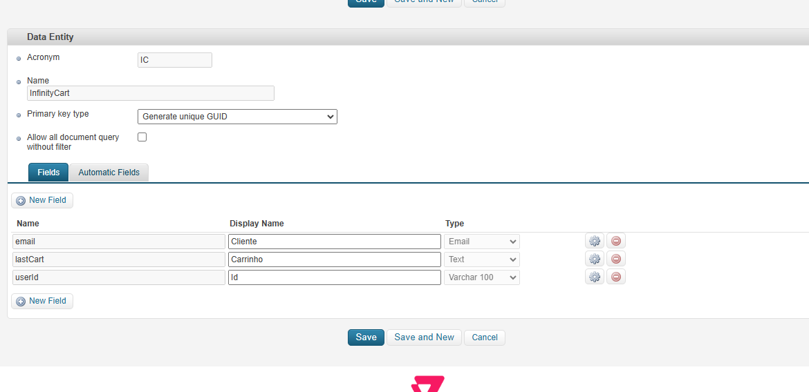
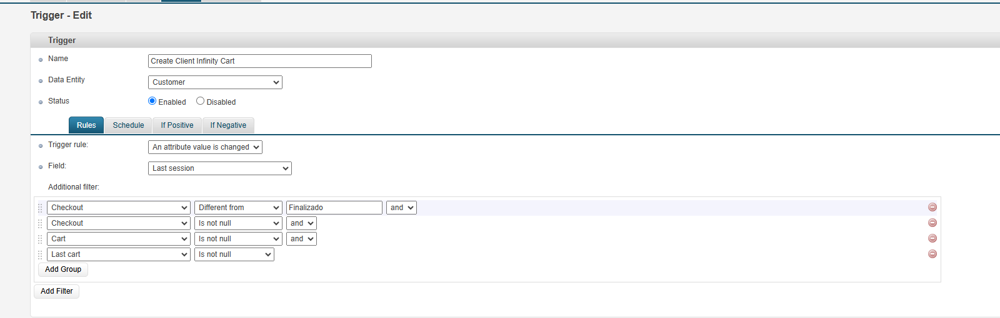
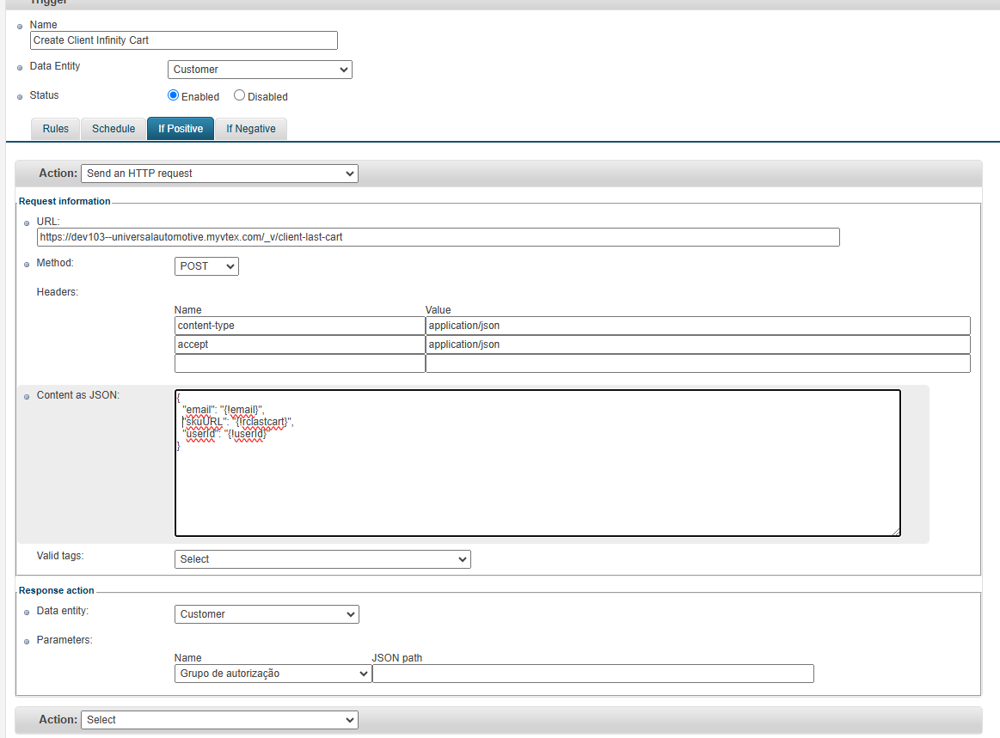
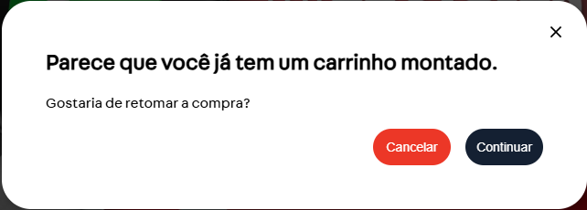

# App para manter o carrinho mesmo apos o cache ser invalidado.

Esse app vai salvar o ultimo carrinho do cliente (não finalizado), algo semelhante ao que o carrinho abandonado faz, e salvará em uma entidade auxiliar o json desse carrinho.


## Instalação do app

1. Crie uma nova branch e mude o `vendor` do `manifest.json` para ser igual ao nome do account da loja que você está instalando o app. Lembrando que a branch deve ter o mesmo nome que o `vendor` da sua loja também.

2. Importe o app nas dependências do seu app no `manifest.json`, assim como o seguinte exemplo:

```json
  "dependencies": {
    "{{vendor}}.inifity-cart": "0.x"
  }
```

## Configuração Entity

- Crie uma entity com o acronimo IC (ou se criar com outro lembre atualizar no código) para salvar as informações do carrinho, esta tabela deve aceitar os campos `email` (tipo email), `lastCart` (tipo Text) e `userId` (tipo Varchar 100);



## Configuração Trigger

Crie um trigger na tabela CL, que ira acionar e salvar esse carrinho, com as seguintes configurações:
- Na aba `Rules` configure conforme o print:



- Na aba de `Schedule` selecione a opção `Run ASAP`;
- Na aba de `If Positive` marque para `Send an HTTP request`, e coloque a url https://{{account}}.myvtex.com/_v/client-last-cart (lembre de alterar o account), e no `Content as JSON` coloque o seguinte json:
```json
{
  "email": "{!email}",
  "skuURL": "{!rclastcart}",
  "userId": "{!userId}"
}
```





E pronto a configuração para salvar o carrinho estará feita.

**OBS: a sessão normalmente leva 30min - 1h para atualizar, então pode ser que leve esse tempo (ou mais) para salvar o carrinho na tabela.**

## Configurando a store

Na store você deve chamar o bloco `"app--client-last-cart"` no header (desk/mob), esse componente é responsável por verificar quando o cliente logou na loja e caso ele tenha um carrinho salvo na tabela, abrirá um modal para confirmação do carregamento desse carrinho.

```json
"header-layout.desktop": {
		"title": "Header - Desktop",
		"children": [
			"app--client-last-cart",
			"header-helmet-custom",
			...
		]
	},
  "header-layout.mobile": {
		"title": "Header - Mobile",
		"children": [
			"app--client-last-cart",
			...
		]
	},
```


E no pagina de orderplaced deve chamar o componente `"app--clear-client-last-cart"` dentro do corpo do orderplaced para ter acesso ao contexto do order, conforme o exemplo:
```json
	"op-header": {
		"children": [
			"app--clear-client-last-cart",
			"op-section#confirmation",
			"op-section#notices",
			"op-summary-section",
			"op-bank-invoice-section"
		]
	},
```

Esse componente é responsável por remover da tabela o carrinho que já foi finalizado.


## Propriedades

Props para o componente **"app--client-last-cart"**, para parte do modal:


| Nome da prop. | Tipo     | Descrição                       | Valor Padrão |
| ------------- | -------- | ------------------------------- | ------------ |
| `modalTitle`        | `string` | Texto para titulo do modal. | `""`         |
| `modalText`        | `string` | Texto para texto do modal. | `""`         |
